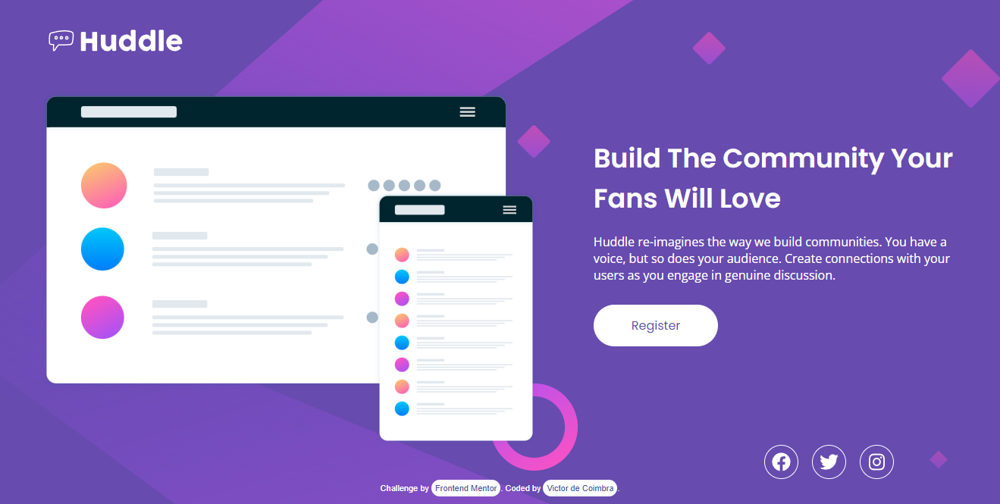

Este projeto é minha solução pra o desafio [Huddle landing page with single introductory section challenge on Frontend Mentor](https://www.frontendmentor.io/challenges/huddle-landing-page-with-a-single-introductory-section-B_2Wvxgi0).

É um desafio simples, mas uma boa prática pra os conceitos e recursos de HTML e CSS.

- [Visão Geral](#visao-geral)
  - [O Desafio](#o-desafio)
  - [Screenshot](#screenshot)
  - [Link pra página](#link-pra-pagina)
- [Processo](#processo)
  - [Ferramentas](#ferramentas)
  - [O que aprendi](#o-que-aprendi)
- [Autor](#autor)

## Visão Geral

### O Desafio

Para esta página, os usuários devem:
     - Conseguir visualizar a página com layout otimizado de acordo com a tela do aparelho utilizado. 
     - Observar os diferentes estados e animações das partes interagíveis ao mover o cursor acima delas.

### Screenshot

### Link pra página

https://victorgominho.github.io/huddle-landing-page/

## Processo

### Ferramentas

- HTML5
- CSS
- Flexbox
- [Google Fonts](https://fonts.google.com) - Biblioteca de Fontes
- [Font Awesome](https://fontawesome.com) - Biblioteca de Ícones

### O que aprendi

Este projeto serviu para praticar várias técnicas de HTML e CSS. É um dos primeiros projetos nos quais tive pouca ou nenhuma ajuda e pude testar meus conhecimentos.

Em resumo, tentei construir a página de duas maneiras: a princípio, tentei usar a propriedade grid-areas do CSS, mas no fim optei por usar Flexbox para organizar as seções do site. No total, fiz dois rascunhos iniciais de como a página terminaria, mas esta versão final foi a que melhor representa como as referências visuais indicavam como o projeto final deveria ficar.

## Autor

- [LinkedIn](https://www.linkedin.com/in/victor-de-coimbra/)
- [GitHub](https://github.com/VictorGominho)
